# 第10章  从头训练 Transformers 模型

在本书的开篇，我们提到了一个名为GitHub Copilot的复杂应用，它使用类似GPT的转化器来执行代码自动完成，这一功能在用新语言或框架编程或学习代码时特别有用，或者用于自动生成模板代码。其他为此目的使用AI模型的产品包括TabNine和Kite。后来，在第5章中，我们仔细研究了如何使用GPT模型来生成高质量的文本。在这一章中，我们将结束这个圈子，建立我们自己的类似GPT的模型来生成Python源代码，我们把生成的模型称为 CodeParrot。

到目前为止，我们主要是在数据受限的应用中工作，在这些应用中，标注的训练数据量是有限的。在这些情况下，转移学习帮助我们建立了高性能的模型。在第9章中，我们将转移学习发挥到了极致，我们几乎没有使用任何训练数据。

在这一章中，我们将走向另一个极端，看看当我们淹没在所有我们可能想要的数据中时，我们可以做些什么。我们将探讨预训练步骤本身，并学习如何从头开始训练一个变换器。在解决这个问题的过程中，我们将研究一些我们还没有考虑过的训练方面的问题，比如说下面这些：

- 收集和处理一个非常大的数据集

- 为我们的数据集创建一个自定义的标记器 

- 在多个GPU上按比例训练一个模型

为了有效地训练具有数十亿参数的大型模型，我们需要专门的工具进行分布式训练。虽然Transformers的训练器支持分布式训练，但我们将借此机会展示一个强大的PyTorch库，名为Accelerate。我们最终会接触到一些目前使用的最大的NLP模型--但首先，我们需要找到一个足够大的数据集。

**警告**

与本书其他章节的代码不同（可以用Jupyter笔记本在单个GPU上运行），本章的训练代码被设计为用多个GPU运行的脚本。如果你想训练你自己的CodeParrot版本，我们建议运行 Hugging face Transformers资源库中提供的脚本。


## 大型数据集以及在哪里可以找到它们

在很多领域，你手头可能真的有大量的数据，从法律文件到生物医学数据集再到编程代码库。在大多数情况下，这些数据集是没有标签的，它们的大尺寸意味着通常只能通过使用启发式方法，或者通过使用在收集过程中存储的附带元数据来标记它们。

然而，一个非常大的语料库即使在没有标签或者只是启发式标签的情况下也是有用的。我们在第9章中看到了这样一个例子，我们使用了数据集的未标记部分来微调一个语言模型，以适应领域。在数据有限的情况下，这种方法通常会产生性能增益。从头开始训练而不是对现有模型进行微调的决定，主要是由你的微调语料库的大小以及可用的预训练模型和语料库之间的领域差异决定的。

使用预训练的模型迫使你使用该模型相应的标记器，但使用在另一个领域的语料库上训练的标记器通常是次优的。例如，在法律文件、其他语言、甚至完全不同的序列（如音符或DNA序列）上使用GPT的预训练标记器将导致糟糕的标记化（正如我们很快会看到的）。

随着你能获得的训练数据量越来越接近用于预训练的数据量，因此，如果有必要的计算资源，考虑从头开始训练模型和标记器就变得很有意义。在我们进一步讨论不同的预训练目标之前，我们首先需要建立一个适合预训练的大型语料库。建立这样的语料库有它自己的一套挑战，我们将在下一节中探讨。

### 建立大规模语料库的挑战

预训练后的模型质量很大程度上反映了预训练语料库的质量。特别是，该模型将继承预训练语料库中的任何缺陷。因此，在我们尝试创建自己的预训练语料库之前，最好先了解一些与建立大型语料库有关的常见问题和挑战。

随着数据集越来越大，你能完全控制--或者至少对里面的内容有一个准确的概念--的机会就会减少。一个非常大的数据集很可能不是由专门的创造者组装的，他们一次只制作一个例子，同时意识到并了解整个流水线和机器学习模型将被应用的任务。相反，更有可能的是，一个非常大的数据集是通过收集其他活动的副产品而产生的数据，以自动或半自动的方式创建的。例如，它可能由一个公司存储的所有文件（如合同、采购订单等）、用户活动的日志或从互联网上收集的数据组成。

大规模的数据集大多是在高度自动化的情况下创建的，这有几个重要的后果。一个重要的考虑是，对它们的内容和创建方式的控制都很有限，因此在有偏见和低质量的数据上训练模型的风险增加了。最近对著名的大规模数据集如BookCorpus和C4的调查，它们分别被用来训练BERT和T5，发现（除其他外）：

- C4语料库的很大一部分是机器翻译的，而不是由人类翻译的。

- 由于C4中的止语过滤，对非裔美国人的英语进行了不同程度的删除，导致此类内容的代表性不足。

- 在大型文本语料库中，通常很难在包括（通常是太多）性或其他明确的内容和完全删除所有提及性或性别的内容之间找到一个中间点。作为一个令人惊讶的结果，像 "性 "这样一个相当常见的词（它可以有中性和明确的含义）对于在C4上训练的标记器来说是完全未知的，因为这个词在语料库中完全没有。

- 在BookCorpus中出现了很多侵犯版权的情况，可能在其他大规模的数据集中也有。

- 在BookCorpus中，存在着对 "浪漫 "小说的体裁倾斜。

这些发现可能与在这些语料库上训练出来的模型的下游用途并不冲突。例如，在BookCorpus中言情小说的比例过高，如果该模型打算被用作言情小说的写作工具或用于建立游戏，这可能是可以接受的。

让我们通过比较GPT和GPT-2的文本生成，来说明模型被数据所歪曲的概念。GPT主要是在BookCorpus上训练的，而GPT-2是在网页、博客和从Reddit链接的新闻文章上训练的。我们将在同一提示上比较两个模型的相似大小的版本，因此主要的区别是预训练数据集，我们将使用文本生成流水线来研究模型的输出:

```
from transformers import pipeline, set_seed 
generation_gpt = pipeline("text-generation", model="openai-gpt") 
generation_gpt2 = pipeline("text-generation", model="gpt2")

```

接下来，让我们创建一个简单的函数来计算每个模型中的参数数量:

```
def model_size(model): 
	return sum(t.numel() for t in model.parameters()) 
	
print(f"GPT size: {model_size(generation_gpt.model)/1000**2:.1f}M parameters") 

print(f"GPT2 size: {model_size(generation_gpt2.model)/1000**2:.1f}M parameters") 

GPT size: 116.5M parameters 
GPT2 size: 124.4M parameters

```

原始的GPT模型与最小的GPT-2模型大小差不多。现在我们可以从每个模型中生成三种不同的续写结果，每个模型都有相同的输入提示:

```
def enum_pipeline_ouputs(pipe, prompt, num_return_sequences): 
	out = pipe(prompt, num_return_sequences=num_return_sequences, clean_up_tokenization_spaces=True) 
	return "\n".join(f"{i+1}." + s["generated_text"] for i, s in enumerate(out)) 

prompt = "\nWhen they came back" 
print("GPT completions:\n" + enum_pipeline_ouputs(generation_gpt, prompt, 3)) 
print("") print("GPT-2 completions:\n" + enum_pipeline_ouputs(generation_gpt2, prompt, 3)) 
GPT completions: 
1.When they came back. 
" we need all we can get, " jason said once they had settled into the back of the truck without anyone stopping them. " after getting out here, it 'll be up to us what to find. for now
2. When they came back. his gaze swept over her body. he 'd dressed her, too, in the borrowed clothes that she 'd worn for the journey. " i thought it would be easier to just leave you there. " a woman like 
3. When they came back to the house and she was sitting there with the little boy
" don't be afraid, " he told her. she nodded slowly, her eyes wide. she was so lost in whatever she discovered that tom knew her mistake

GPT-2 completions: 
1. When they came back we had a big dinner and the other guys went to see what their opinion was on her. I did an hour and they were happy with it.
2. When they came back to this island there had been another massacre, but he could not help but feel pity for the helpless victim who had been left to die, and that they had failed that day. And so was very, very grateful indeed. 
3. When they came back to our house after the morning, I asked if she was sure. She said, "Nope." The two kids were gone that morning. I thought they were back to being a good friend.

When Dost

```

通过对两个模型的少量输出进行抽样，我们已经可以看到GPT生成中独特的 "浪漫 "倾斜，它通常会想象一个女人和一个男人之间浪漫互动的对话。另一方面，GPT-2是在链接到Reddit文章和来自Reddit文章的网络文本上进行训练的，在其生成中大多采用中性的 "他们"，其中包含 "博客式 "或与冒险相关的元素。

一般来说，任何在数据集上训练的模型都会反映出其训练数据中的语言偏见以及对群体和事件的过度或不足表达。对于与模型互动的目标受众来说，模型行为中的这些偏差是需要考虑的；对于一些有用的指南，我们推荐你参考谷歌的一篇论文，该论文提供了一个数据集开发的框架。

这个简单的介绍应该让你了解到在创建大型文本语料库时面临的困难挑战。考虑到这些，现在让我们来看看如何创建我们自己的数据集吧。

### 建立一个自定义代码数据集

为了简化任务，我们将专注于只为Python编程语言建立一个代码生成模型。我们首先需要的是一个由Python源代码组成的大型预训练语料库。幸运的是，有一个每个软件工程师都知道的天然资源：GitHub! 这个著名的代码共享网站承载了数兆字节的代码库，这些代码库是公开的，可以根据其各自的许可证下载和使用。在本书写作之时，GitHub托管了超过2000万个代码库。其中许多是用户为学习、未来的副业项目或测试目的而创建的小型或测试库。

GitHub 仓库可以通过两种主要方式访问:

- 通过GitHub REST API，就像我们在第9章中看到的那样，我们下载了Transformers仓库的所有GitHub问题。

- 通过公共数据集目录，如Google BigQuery


由于REST API的速率有限，而且我们的预训练语料库需要大量的数据，我们将使用Google BigQuery来提取所有的Python资源库。bigquery-public-data.github_repos.contents表包含所有大小小于10MB的ASCII文件的副本。根据GitHub的License API确定，项目也需要是开源的，才能被包括在内。


**小技巧**

Google BigQuery数据集不包含星级或下游使用信息。对于这些属性，我们可以使用GitHub的REST API或像Libraries.io这样的监测开源包的服务。事实上，GitHub的一个团队最近发布了一个名为CodeSearchNet的数据集，利用Libraries.io的信息过滤了至少在一个下游任务中使用的存储库。

让我们看看用Google BigQuery创建我们的代码数据集需要什么。

### 用Google BigQuery创建一个数据集

我们将首先从谷歌BigQuery的快照中提取GitHub公共仓库中的所有Python文件。为了重现性，并且为了防止未来围绕免费使用BigQuery的政策发生变化，我们还将在Hugging Face Hub上分享这个数据集。输出这些文件的步骤改编自TransCoder的实现，如下所示：

1.创建一个谷歌云账户（免费试用应该就够了）。
2. 在你的账户下创建一个Google BigQuery项目。
3. 在这个项目中，创建一个数据集。
4. 在这个数据集中，创建一个表，SQL请求的结果将被存储。
5. 在github_repos上准备并运行以下SQL查询（要保存查询结果，选择 "更多">"查询选项"，勾选 "为查询结果设置目标表 "框，并指定表名）。


```
SELECT 
f.repo_name, f.path, c.copies, c.size, c.content, l.license 
FROM `bigquery-public-data.github_repos.files` AS f 
JOIN `bigquery-public-data.github_repos.contents` AS c ON f.id = c.id 
JOIN `bigquery-public-data.github_repos.licenses` AS l ON f.repo_name = l.repo_name 
WHERE NOT c.binary
AND ((f.path LIKE '%.py') 
AND (c.size BETWEEN 1024 AND 1048575))

```

这个命令处理了大约2.6TB的数据，提取了2680万个文件。结果是一个大约50GB的压缩JSON文件的数据集，每个文件都包含Python文件的源代码。我们过滤掉了空文件和小文件，如__init__.py，这些文件并不包含很多有用的信息。我们还过滤掉了大于1MB的文件，并且下载了所有文件的许可证，这样我们以后就可以根据许可证来过滤训练数据。

接下来，我们将把结果下载到我们的本地机器上。如果你在家里尝试这样做，确保你有良好的带宽和至少50GB的可用磁盘空间。把结果表拿到你的本地机器上的最简单方法是遵循这个两步过程：

1. 将你的结果导出到谷歌云。
a. 在谷歌云存储（GCS）中创建一个桶和一个文件夹。

b. 通过选择 "导出">"导出到GCS "将你的表导出到这个桶中，导出格式为JSON和gzip压缩。
2. 2. 使用gsutil库，将桶下载到你的机器上。
a. 用 pip install gsutil 来安装 gsutil。
b. 用你的谷歌账户配置gsutil：gsutil config。
c. 在你的机器上复制你的水桶。

```
$ gsutil -m -o "GSUtil:parallel_process_count=1" 
cp -r gs://<name_of_bucket>

```

或者，你可以用以下命令直接从Hugging Face中心下载数据集:

```
$ git clone https://huggingface.co/datasets/transformersbook/codeparrot

```

------

**是否要过滤噪音？**

任何人都可以创建一个GitHub仓库，所以项目的质量各不相同。对于我们希望系统在现实世界中的表现，我们需要做出一些有意识的选择。在训练数据集中有一些噪音，会使我们的系统在推理时对噪音输入更加稳健，但也会使其预测更加随机。根据预期的用途和整个系统的整合，你可以选择更多或更少的噪声数据，并增加预过滤和后过滤的操作。

为了本章的教育目的，并保持数据准备代码的简洁，我们将不根据明星或用途进行过滤，而只是抓取GitHub BigQuery数据集中的所有Python文件。然而，数据准备是一个关键步骤，你应该确保尽可能地清理你的数据集。在我们的案例中，需要考虑的几件事是：是否平衡数据集中的编程语言；过滤低质量的数据（例如，通过GitHub星级或来自其他仓库的引用）；删除重复的代码样本；考虑版权信息；调查文档、评论或文档字符串中使用的语言；以及删除个人识别信息，如密码或钥匙。

------

处理50GB的数据集是一个挑战；它需要足够的磁盘空间，而且必须小心不要耗尽内存。在下一节中，我们将看看数据集如何帮助处理这些在小型机器上处理大型数据集的限制。

### 处理大型数据集

加载一个非常大的数据集往往是一个具有挑战性的任务，特别是当数据大于你的机器的RAM时。对于一个大规模的预训练数据集来说，这是一个非常常见的情况。在我们的例子中，我们有50GB的压缩数据和大约200GB的未压缩数据，这很难提取并加载到一个标准尺寸的笔记本电脑或台式电脑的RAM内存中。

值得庆幸的是，Hugging face Datasets的设计从头到尾都是为了克服这个问题，它有两个特殊的功能，可以让你摆脱内存和硬盘空间的限制：内存映射和流式访问。

#### 内存映射

为了克服RAM的限制，Datasets使用了一种默认激活的零拷贝和零开销的内存映射机制。基本上，每个数据集都被缓存在硬盘上的一个文件中，该文件是RAM内存中内容的直接反映。数据集不是在RAM中加载数据集，而是打开一个指向该文件的只读指针，将其作为RAM的替代品，基本上将硬盘作为RAM内存的直接扩展。

到目前为止，我们大多使用数据集来访问Hugging Face Hub上的远程数据集。在这里，我们将直接加载我们在本地存储在codeparrot资源库中的50GB压缩JSON文件。由于JSON文件是压缩的，我们首先需要对其进行解压，Datasets为我们解决了这个问题。请注意，这需要大约180GB的可用磁盘空间。不过，它几乎不会使用RAM。通过在数据集的下载配置中设置delete_extracted=True，我们可以确保尽快删除所有我们不再需要的文件：

```
from datasets import load_dataset, DownloadConfig 
download_config = DownloadConfig(delete_extracted=True)

dataset = load_dataset("./codeparrot", split="train", download_config=download_config)

```

在引擎盖下，Hugging face Datasets通过在一个优化的缓存文件中加载所有压缩的JSON文件，提取并读取这些文件。让我们看看这个数据集加载之后有多大:

```
import psutil
print(f"Number of python files code in dataset : {len(dataset)}") 
ds_size = sum(os.stat(f["filename"]).st_size for f in dataset.cache_files)
# os.stat.st_size is expressed in bytes, so we convert to GB 
print(f"Dataset size (cache file) : {ds_size / 2**30:.2f} GB") 
# Process.memory_info is expressed in bytes, so we convert to MB 
print(f"RAM used: {psutil.Process(os.getpid()).memory_info().rss >> 20} MB") 

Number of python files code in dataset : 18695559 
Dataset size (cache file) : 183.68 GB 
RAM memory used: 4924 MB

```

正如我们所看到的，数据集比我们典型的RAM内存大得多，但我们仍然可以加载和访问它，实际上我们使用的内存量非常有限。

你可能想知道这是否会使我们的训练受到I/O限制。在实践中，与模型处理计算相比，NLP数据的加载通常是非常轻的，所以这很少是一个问题。此外，zerocopy/zero-overhead格式在引擎盖下使用Apache Arrow，这使得访问任何元素都非常高效。根据你的硬盘速度和批量大小，在数据集上的迭代通常可以以万分之几到几GB/s的速度完成。这很好，但如果你不能腾出足够的磁盘空间在本地存储完整的数据集怎么办？每个人都知道那种无助的感觉，当你收到磁盘已满的警告，需要痛苦地试图通过寻找要删除的隐藏文件来找回几GB的空间。幸运的是，如果你使用数据集的流式功能，你就不需要将完整的数据集存储在本地了！"。

#### 流式访问

一些数据集（达到1TB或更多）即使在一个标准的硬盘上也很难装下。在这种情况下，除了扩大你所使用的服务器的规模之外，还有一个办法就是将数据集流化。对于一些可以逐行读取的压缩或未压缩的文件格式，如JSON行、CSV或文本（原始或zip、gzip或zstandard压缩），也可以使用数据集。让我们直接从压缩的JSON文件加载我们的数据集，而不是从它们创建一个缓存文件：

```
streamed_dataset = load_dataset('./codeparrot', split="train", streaming=True)

```

正如你所看到的，加载数据集是瞬间完成的! 在流模式下，压缩的JSON文件将被打开，并在空中读取。我们的数据集现在是一个IterableDataset对象。这意味着我们不能访问其中的随机元素，比如streamed_dataset[1264]，但我们需要按顺序读取，比如用 next(iter(streamed_dataset))。仍然可以使用shuffle()这样的方法，但是这些方法的操作方式是获取一个例子的缓冲区并在这个缓冲区内进行洗牌（缓冲区的大小是可以调整的）。当几个文件以原始文件的形式提供时（就像我们这里的184个文件），shuffle()也将为迭代随机化文件的顺序。

我们可以看到，流式数据集的样本与非流式数据集的样本是相同的：

```
iterator = iter(streamed_dataset) 
print(dataset[0] == next(iterator)) 
print(dataset[1] == next(iterator)) 
True
True

```

使用流式数据集的主要兴趣在于，加载这个数据集不会在硬盘上创建一个缓存文件，也不需要任何（大量）RAM内存。当新的一批例子被请求时，原始的原始文件被提取出来并在运行中被读取，并且只有那一批被加载到内存中。这就把我们的数据集的内存占用从180GB减少到50GB。但我们可以更进一步--我们可以不指向本地数据集，而是引用Hub上的数据集，然后直接下载样本，而不在本地下载原始文件：

```
remote_dataset = load_dataset('transformersbook/codeparrot', split="train", streaming=True)

```

这个数据集的行为与前一个数据集完全一样，但在幕后即时下载实例。有了这样一个设置，我们就可以在一个（几乎）任意小的服务器上使用任意大的数据集。让我们把我们的数据集与训练和验证分开推送到Hugging Face Hub，并通过流式访问它。

### 将数据集添加到 Hugging Face Hub

将我们的数据集推送到 Hugging Face中心，将使我们能够:

- 从我们的训练服务器上轻松访问它。
- 看看流式数据集是如何与中心的数据集无缝衔接的。
- 与社区分享，包括你，亲爱的读者!

为了上传数据集，我们首先需要登录我们的Hugging Face账户，在终端运行以下命令并提供相关凭证:

```
$ huggingface-cli login

```

这相当于我们在以前章节中使用的notebook_login()辅助函数。一旦完成这些，我们就可以直接在Hub上创建一个新的数据集，并上传压缩的JSON文件。为了简化事情，我们将创建两个存储库：一个用于训练分割，一个用于验证分割。我们可以通过运行CLI的repo create命令来完成这一工作，如下所示：

```
$ huggingface-cli repo create --type dataset --organization transformersbook \ codeparrot-train 
$ huggingface-cli repo create --type dataset --organization transformersbook \ codeparrot-valid

```

这里我们指定存储库应该是一个数据集（与用于存储权重的模型存储库不同），以及我们想在哪个组织下存储存储库。如果你是在个人账户下运行这段代码，你可以省略--组织标志。接下来，我们需要克隆这些空的存储库到我们的本地机器上，把JSON文件复制到这些存储库中，然后把这些变化推送到Hub上。我们将从我们拥有的184个压缩的JSON文件中取出最后一个作为验证文件（即大约是我们数据集的0.5%）。执行这些命令，将版本库从Hub上克隆到你的本地机器上：

```
$ git clone https://huggingface.co/datasets/transformersbook/codeparrot-train 
$ git clone https://huggingface.co/datasets/transformersbook/codeparrot-valid

```

接下来，除了最后一个GitHub文件外，复制所有文件作为训练集：

```
$ cd codeparrot-train 
$ cp ../codeparrot/*.json.gz . 
$ rm ./file-000000000183.json.gz

```

然后提交文件并将其推送到Hub：

```
$ git add . 
$ git commit -m "Adding dataset files" 
$ git push

```

现在，对验证集重复这一过程：

```
$ cd ../codeparrot-valid 
$ cp ../codeparrot/file-000000000183.json.gz . 
$ mv ./file-000000000183.json.gz ./file-000000000183_validation.json.gz 
$ git add . 
$ git commit -m "Adding dataset files"
$ git push

```

由于要计算所有文件的哈希值，git add .步骤可能需要几分钟。上传所有的文件也会花一点时间。由于这将使我们在本章后面使用流式，然而，这并不是损失的时间，这一步将使我们在其余的实验中大大加快。注意，我们在验证文件名中加入了_validation的后缀。这将使我们以后能把它作为一个验证分片加载。

就这样了! 我们的两个分割数据集以及完整的数据集现在都在拥抱脸部中心上线，网址如下：

- https://huggingface.co/datasets/transformersbook/codeparrot 
- https://huggingface.co/datasets/transformersbook/codeparrot-train
-  https://huggingface.co/datasets/transformersbook/codeparrot-valid


 **注意事项**

添加README卡是很好的做法，它解释了数据集是如何创建的，并尽可能多地提供关于它们的有用信息。一个记录良好的数据集更有可能对其他人，以及你未来的自己有用。你可以阅读数据集README指南，了解如何写好数据集文档的详细说明。以后你也可以用网络编辑器在Hub上直接修改你的README卡。


## 构建一个标记化器 （tokenizer)

现在我们已经收集并加载了我们的大数据集，让我们来看看如何有效地处理数据以反馈给我们的模型。在以前的章节中，我们使用了伴随我们使用的模型的标记器。这是有道理的，因为这些模型是使用通过标记器中定义的特定预处理流水线的数据进行预训练的。当使用预训练的模型时，坚持使用为预训练选择的相同的预处理设计是很重要的。否则，该模型可能会被送入分布错误的模式或未知的标记。

然而，当我们训练一个新模型时，使用为另一个数据集准备的标记器可能是次优的。下面是几个例子，说明我们在使用现有标记器时可能遇到的问题：

- T5标记器是在我们之前遇到的C4语料库上训练的，但在创建它时使用了大量的停顿词过滤步骤。因此，T5标记器从未见过诸如 "性 "这样的常见英语单词。

- CamemBERT标记器也是在一个非常大的文本语料库上训练的，但只包括法语文本（OSCAR语料库的法语子集）。因此，它不知道常见的英语单词，如 "being"。

我们可以很容易地在实践中测试每个标记器的这些特征：

```
from transformers import AutoTokenizer 
def tok_list(tokenizer, string):
	input_ids = tokenizer(string, add_special_tokens=False)["input_ids"] 
	return [tokenizer.decode(tok) for tok in input_ids] 
tokenizer_T5 = AutoTokenizer.from_pretrained("t5-base") 
tokenizer_camembert = AutoTokenizer.from_pretrained("camembert-base") 
print(f'T5 tokens for "sex": {tok_list(tokenizer_T5,"sex")}')
print(f'CamemBERT tokens for "being": {tok_list(tokenizer_camembert,"being")}') 

T5 tokens for "sex": ['', 's', 'ex'] 
CamemBERT tokens for "being": ['be', 'ing']

```

在许多情况下，将这种短小而常见的词拆分成子部分将是低效的，因为这将增加模型的输入序列长度（其上下文有限）。因此，必须了解用于训练标记器的数据集的领域和预处理情况。标记器和模型可以编码来自数据集的偏见，对模型的下游行为有影响。为了给我们的数据集创建一个最佳的标记器，我们需要自己训练一个标记器。让我们看看如何做到这一点。

**注意事项**

训练一个模型需要从一组给定的权重开始，并使用来自误差信号的反向传播，在设计的目标上使模型的损失最小化，并为模型找到一组最佳的权重来完成训练目标所定义的任务。另一方面，训练标记器并不涉及反向传播或权重。它是一种创建从文本字符串到整数列表的最佳映射的方法，可以被模型所吸收。在今天的标记器中，最佳的字符串到整数的转换涉及到一个由原子字符串列表组成的词汇表，以及一个相关的方法来转换、归一化、切割或将文本字符串映射到具有该词汇表的索引列表。然后，这个索引列表是我们的神经网络的输入。

### 标记器模型 （Tokenizer Model)

正如你在第四章所看到的，标记器是一个由四个步骤组成的处理流水线：规范化、预标记化、标记器模型和后处理。标记器流水线中可以在数据上进行训练的部分是标记器模型。正如我们在第二章所讨论的，有几种子词标记化算法可以使用，如BPE、WordPiece和Unigram。

BPE从基本单元（单个字符）的列表开始，通过逐步创建新的令牌的过程来创建词汇，这些令牌是由最经常共同出现的基本单元合并而成的，并将其加入到词汇中。这个过程不断重复，直到达到预定的词汇量。

Unigram从另一端开始，用语料库中的所有词和潜在的子词初始化其基本词汇。然后，它逐步删除或拆分不太有用的标记，以获得越来越小的词汇量，直到达到目标词汇量。WordPiece是Unigram的前身，其官方实现从未被谷歌开放。

这些不同的算法对下游性能的影响因任务的不同而不同，总体而言，要确定一种算法是否明显优于其他算法是相当困难的。BPE和Unigram在大多数情况下都有合理的性能，但让我们看一下评估时需要考虑的一些方面。

### 测量标记器性能

标记器的优化和性能在实践中很难衡量。一些可能的衡量标准包括:

- 子词生产率，计算每个标记化词产生的子词的平均数量 
- 延续词的比例，指的是语料库中至少分成两个子词的标记化词的比例。
- 覆盖率指标，如标记化语料库中的未知词或很少使用的标记的比例

此外，对拼写错误或噪音的稳健性也经常被估计，以及对这种域外实例的模型性能，因为这在很大程度上取决于标记化过程。

这些措施对标记器的性能给出了一系列不同的看法，但它们往往忽略了标记器与模型的互动。例如，子词生育率可以通过包括词汇表中所有可能的词来最小化，但这将为模型产生一个非常大的词汇表。

因此，最终，各种标记化方法的性能通常最好通过使用模型的下游性能作为最终指标来估计。例如，早期的BPE方法的良好性能表现为，使用这些标记化器和词汇表而不是基于字符或单词的标记化训练的模型在机器翻译任务上的性能有所提高。

让我们看看如何建立我们自己的为Python代码优化的标记器。


#### 用于Python的标记器

我们需要一个自定义的标记器来满足我们的用例：对Python代码进行标记。预标记化的问题值得对编程语言进行一些讨论。如果我们在空白处分割并删除它们，我们就会失去所有的缩进信息，这在Python中对程序的语义很重要（想想while循环，或者if-then-else语句）。另一方面，换行是没有意义的，可以在不影响语义的情况下增加或删除。同样，在标点符号上进行分割，比如下划线，它被用来从几个子部分组成一个单一的变量名称，可能不像在自然语言中那样有意义。因此，使用自然语言的预标记器对代码进行标记可能是次优的。

让我们看看在Hub上提供的集合中是否有对我们有用的标记器。我们想要一个保留空间的标记器，所以一个好的候选者可能是一个字节级的标记器，比如GPT-2的那个。让我们加载这个标记器并探索其标记属性:

```
from transformers import AutoTokenizer 
python_code = r"""
def say_hello(): 
	print("Hello, World!") 
# Print it say_hello() """ 
tokenizer = AutoTokenizer.from_pretrained("gpt2") 
print(tokenizer(python_code).tokens()) 

['def', 'Ġsay', '_', 'hello', '():', 'Ċ', 'Ġ', 'Ġ', 'Ġ', 'Ġprint', '("', 'Hello', ',', 'ĠWorld', '!"', ')', 'Ġ#', 'ĠPrint', 'Ġit', 'Ċ', 'Ċ', 'say', '_', 'hello', '()', 'Ċ']

```

**注意事项**

Python有一个内置的tokenize模块，可以将Python代码字符串分割成有意义的单元（代码操作、注释、缩进和扣除，等等）。使用这种方法的一个问题是，这种预标记器是基于Python的，因此通常相当慢，而且受到Python全局解释器锁（GIL）的限制。另一方面，Transformers库中的大部分标记器是由Tokenizers库提供的，并且是用Rust编码的。Rust标记器的训练和使用速度要快很多个数量级，因此考虑到我们的语料库的规模，我们很可能想使用它们。


这是一个相当奇怪的输出，所以让我们试着通过运行标记器流水线的各个子模块来了解这里发生了什么。首先，让我们看看在这个标记器中应用了什么规范化：

```
print(tokenizer.backend_tokenizer.normalizer)
None

```

正如我们所看到的，GPT-2标记器没有使用规范化。它直接在原始Unicode输入上工作，没有任何规范化步骤。现在让我们来看看预编码的情况：

```
print(tokenizer.backend_tokenizer.pre_tokenizer.pre_tokenize_str(python_code)) 

[('def', (0, 3)), ('Ġsay', (3, 7)), ('_', (7, 8)), ('hello', (8, 13)), ('():', (13, 16)), ('ĊĠĠĠ', (16, 20)), ('Ġprint', (20, 26)), ('("', (26, 28)), ('Hello', (28, 33)), (',', (33, 34)), ('ĠWorld', (34, 40)), ('!")', (40, 43)), ('Ġ#', (43, 45)), ('ĠPrint', (45, 51)), ('Ġit', (51, 54)), ('Ċ', (54, 55)), ('Ċ', (55, 56)), ('say', (56, 59)), ('_', (59, 60)), ('hello', (60, 65)), ('()', (65, 67)), ('Ċ', (67, 68))]

```

这些Ġ符号是什么，伴随着标记的数字又是什么？让我们解释一下这两点，看看我们是否能更好地理解这个标记器的工作原理。

让我们从数字开始。Tokenizers有一个非常有用的功能，用于在字符串和标记之间切换，称为偏移量跟踪。对输入字符串的所有操作都会被跟踪，这样就有可能确切地知道标记化后的一个标记对应于输入字符串的哪一部分。这些数字只是表明每个标记在原始字符串中的位置；例如，第一行中的单词'hello'对应于原始字符串中的8到13个字符。如果在规范化步骤中删除了一些字符，我们仍然能够将每个标记与原始字符串中的相应部分联系起来。

标记化文本的另一个奇怪的特征是看起来很奇怪的字符，如Ċ和Ġ。字节级的意思是这个标记器是在字节而不是Unicode字符上工作。每个Unicode字符由1到4个字节组成，这取决于该字符。字节的好处是，虽然Unicode字母表中有143,859个Unicode字符，但字节字母表中只有256个元素，你可以将每个Unicode字符表示为这些字节的序列。如果我们在字节上工作，我们就可以将所有从UTF-8世界中组成的字符串表达为这个256值的字母表中的较长字符串。也就是说，我们可以有一个使用只有256个字的字母表的模型，并且能够处理任何Unicode字符串。让我们来看看一些字符的字节表示是什么样子的：

```
a, e = u"a", u"€"
byte = ord(a.encode("utf-8"))
print(f'`{a}` is encoded as `{a.encode("utf-8")}` with a single byte: {byte}')
byte = [ord(chr(i)) for i in e.encode("utf-8")] 
print(f'`{e}` is encoded as `{e.encode("utf-8")}` with three bytes: {byte}') 

`a` is encoded as `b'a'` with a single byte: 97 
`€` is encoded as `b'\xe2\x82\xac'` with three bytes: [226, 130, 172]

```

在这一点上，你可能会想：为什么要在字节级上工作？回想一下我们在第二章中关于字符和词的权衡的讨论。我们可以决定从143,859个Unicode字符中建立我们的词汇，但是我们也想在我们的词汇中包括单词--即Unicode字符的组合，所以这个（已经非常大的）尺寸只是词汇总尺寸的下限。这将使我们模型的嵌入层变得非常大，因为它包括每个词汇标记的一个向量。

在另一个极端，如果我们只使用256个字节的值作为我们的词汇，那么输入序列将被分割成许多小块（每个字节构成Unicode字符），因此我们的模型将不得不在长的输入上工作，并花费大量的计算能力从独立的字节中重建Unicode字符，然后再从这些字符中重建字。关于这种开销的详细研究，请参见ByT5模型发布时的论文。

一个中间解决方案是通过用最常见的字节组合来扩展256个字的词汇表来构建一个中等规模的词汇表。这就是BPE算法所采取的方法。其思路是通过迭代合并词汇中最频繁出现的一对标记来创建新的词汇标记，从而逐步构建一个预定规模的词汇。例如，如果t和h非常频繁地出现在一起，比如在英语中，我们将在词汇中添加一个token th来模拟这对token，而不是将它们分开。t和h的标记被保留在词汇中，以便对它们不同时出现的情况进行标记。从基本单元的词汇开始，我们可以有效地对任何字符串进行建模。

**警告**

注意不要将 "字节对编码 "中的 "字节 "与 "字节级 "中的 "字节 "混淆。字节对编码这一名称来自于菲利普-盖奇在1994年提出的一种数据压缩技术，最初是对字节进行操作。与这个名字可能表明的不同，NLP中的标准BPE算法通常在Unicode字符串而不是字节上操作（尽管有一种新的BPE专门在字节上工作，称为字节级BPE）。如果我们用字节来读取我们的Unicode字符串，我们就可以重新使用一个简单的BPE子字分割算法。


在NLP中使用典型的BPE算法时，只有一个问题。这些算法被设计为使用干净的Unicode字符串作为输入，而不是字节，并期望在输入中使用常规的ASCII字符，没有空格或控制字符。但是在对应于256个第一字节的Unicode字符中，有许多控制字符（换行、制表、转义、换行和其他不可打印的字符）。为了克服这个问题，GPT-2标记器首先将所有256个输入字节映射为Unicode字符串，这些字符串很容易被标准的BPE算法消化--也就是说，我们将把我们的256个基本值映射为Unicode字符串，这些字符串都对应于标准的可打印Unicode字符。

这些Unicode字符每个都用1个或更多的字节编码并不是很重要；重要的是我们在最后有256个单值，形成我们的基础词汇，并且这256个值被我们的BPE算法正确处理。让我们看看这个映射与GPT-2标记器的一些例子。我们可以按以下方式访问整个映射：

```
from transformers.models.gpt2.tokenization_gpt2 
import bytes_to_unicode 
byte_to_unicode_map = bytes_to_unicode() 
unicode_to_byte_map = dict((v, k) for k, v in byte_to_unicode_map.items()) 
base_vocab = list(unicode_to_byte_map.keys()) 
print(f'Size of our base vocabulary: {len(base_vocab)}') 
print(f'First element: `{base_vocab[0]}`, last element: `{base_vocab[-1]}`') 

Size of our base vocabulary: 256 
First element: `!`, last element: `Ń`

```

而我们可以在表10-1中看看一些常见的字节值和相关的映射的Unicode字符。

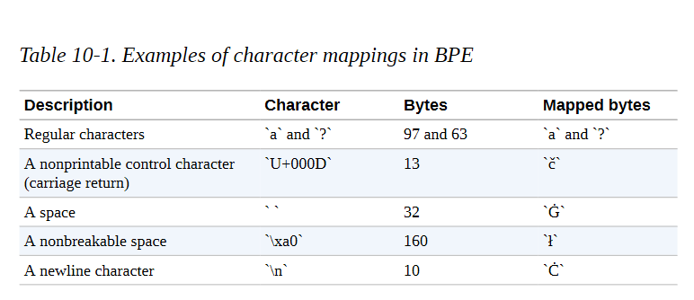

我们可以使用更明确的转换方式，比如将换行符映射到NEWLINE字符串，但BPE算法通常是为字符设计的。出于这个原因，为每个字节字符保留一个Unicode字符，用开箱即用的BPE算法更容易处理。现在我们已经了解了Unicode编码的黑暗魔法，我们可以更好地理解我们的标记化转换：

```
print(tokenizer.backend_tokenizer.pre_tokenizer.pre_tokenize_str(python_code))

[('def', (0, 3)), ('Ġsay', (3, 7)), ('_', (7, 8)), ('hello', (8, 13)), ('():', (13, 16)), ('ĊĠĠĠ', (16, 20)), ('Ġprint', (20, 26)), ('("', (26, 28)), ('Hello', (28, 33)), (',', (33, 34)), ('ĠWorld', (34, 40)), ('!")', (40, 43)), ('Ġ#', (43, 45)), ('ĠPrint', (45, 51)), ('Ġit', (51, 54)), ('Ċ', (54, 55)), ('Ċ', (55, 56)), ('say', (56, 59)), ('_', (59, 60)), ('hello', (60, 65)), ('()', (65, 67)), ('Ċ', (67, 68))]

```

我们可以认出换行符，我们现在知道换行符被映射到Ċ，还有空格，被映射到Ġ。我们还可以看到：

- 空格，特别是连续的空格，是被保留的（例如，'ĊĠĠ'中的三个空格）。

- 连续的空格被认为是一个词。

- 一个词前面的每个空格都附加在后面的词上，并被认为是后面的词的一部分（例如，在'Ġsay'中）。

现在让我们用BPE模型做实验。正如我们所提到的，它负责将单词分割成子单元，直到所有子单元都属于预定义的词汇。

我们的GPT-2标记器的词汇量包括50,257个词：

- 带有256个字节值的基础词汇表 

- 通过反复合并最常见的共同出现的标记创建的50,000个额外标记 

- 词汇中加入了一个特殊的字符，以表示文件的边界

我们可以通过查看标记器的长度属性来轻松检查：

```
print(f"Size of the vocabulary: {len(tokenizer)}") 
Size of the vocabulary: 50257

```

在我们的输入代码上运行完整的流水线，我们得到了以下输出：

```
print(tokenizer(python_code).tokens()) 
['def', 'Ġsay', '_', 'hello', '():', 'Ċ', 'Ġ', 'Ġ', 'Ġ', 'Ġprint', '("', 'Hello', ',', 'ĠWorld', '!"', ')', 'Ġ#', 'ĠPrint', 'Ġit', 'Ċ', 'Ċ', 'say', '_', 'hello', '()', 'Ċ']

```

我们可以看到，BPE标记器保留了大部分单词，但会将我们缩进的多个空格分割成几个连续的空格。发生这种情况是因为这个标记器并不是专门针对代码进行训练的，而是主要针对连续空格很少的文本。因此，BPE模型并没有在缩进的词汇中包括一个特定的标记。这是一个标记器模型不适合数据集领域的情况。正如我们前面所讨论的，解决方案是在目标语料库上重新训练标记器。所以，让我们开始行动吧！

### 训练标记器

让我们在语料库的一个片断上重新训练我们的字节级BPE标记器，以得到一个更适合Python代码的词汇。重新训练Transformers提供的标记器很简单。我们只需要：

- 指定我们的目标词汇表大小。
- 准备一个迭代器来提供输入字符串的列表，以处理训练标记器的模型。
- 调用train_new_from_iterator()方法。

与深度学习模型不同的是，深度学习模型通常要从训练语料库中记忆很多具体细节，而标记器实际上只是被训练来提取主要的统计数据。简而言之，标记器只是被训练来知道哪些字母组合在我们的语料库中是最频繁的。

因此，你不一定需要在一个非常大的语料库上训练你的标记器；语料库只需要对你的领域有代表性，并且大到足以让标记器提取具有统计学意义的措施。但是，根据语料库中的词汇量和确切的文本，标记器最终可能会存储意想不到的词。例如，在查看GPT-2标记器的词汇中最长的词时，我们可以看到这一点：

```
tokens = sorted(tokenizer.vocab.items(), key=lambda x: len(x[0]), reverse=True)
print([f'{tokenizer.convert_tokens_to_string(t)}' for t, _ in tokens[:8]]); ['ÃÂÃÂÃÂÃÂÃÂÃÂÃÂÃÂÃÂÃÂÃÂÃÂÃÂÃÂÃÂÃÂÃÂÃÂÃÂÃÂÃÂÃÂÃÂÃÂÃÂÃÂÃÂÃÂÃÂÃÂÃÂÃÂ',
' =================================================================', 
' ---------------------------------------------------------------', '................................................................', 'ÃÂÃÂÃÂÃÂÃÂÃÂÃÂÃÂÃÂÃÂÃÂÃÂÃÂÃÂÃÂÃÂ'
' ---------------------------------------------------------------', '================================================================', '________________________________________________________________']

```

这些标记看起来像论坛上可能使用的分隔线。这很合理，因为GPT-2是在以Reddit为中心的语料库上训练的。现在让我们来看看最后被添加到词汇中的词，也就是最不频繁的词：

```
tokens = sorted(tokenizer.vocab.items(), key=lambda x: x[1], reverse=True) 
print([f'{tokenizer.convert_tokens_to_string(t)}' for t, _ in tokens[:12]]); 

['<|endoftext|>', ' gazed', ' informants', ' Collider', ' regress', 'ominated', ' amplification', 'Compar', '..."', ' (/', 'Commission', ' Hitman']

```

第一个标记，<|endoftext|>，是用于指定文本序列结束的特殊标记，是在BPE词汇库建立后加入的。对于这些标记中的每一个，我们的模型将不得不学习一个相关的单词嵌入，而我们可能不希望嵌入矩阵包含太多的噪音单词。还请注意，在我们的建模方法中，一些非常具有时间和空间特征的世界知识（例如，像Hitman和Commission这样的专有名词）是如何在很低的水平上被嵌入的，即这些词被授予单独的令牌，在词汇中具有相关的向量。BPE标记器创建这种特定的标记，也可以说明目标词汇量太大，或者语料库包含特异性的标记。

让我们在我们的语料库上训练一个新的标记器，并检查它学到的词汇。由于我们只需要一个合理地代表我们的数据集统计的语料库，让我们从我们的语料库中选择大约1-2GB的数据，或者大约10万个文档：

```
from tqdm.auto import tqdm 
length = 10000
dataset_name = 'transformersbook/codeparrot-train' 
dataset = load_dataset(dataset_name, split="train", streaming=True) 
iter_dataset = iter(dataset) 
def batch_iterator(batch_size=10): 
	for _ in tqdm(range(0, length, batch_size)): 
		yield [next(iter_dataset)['content'] for _ in range(batch_size)] 

new_tokenizer = tokenizer.train_new_from_iterator(batch_iterator(), vocab_size=12500, initial_alphabet=base_vocab)

```

让我们调查一下我们的BPE算法所创造的第一个和最后一个词，看看我们的词汇量有多大的关联。我们跳过256字节的标记，看看此后添加的第一个标记：

```
tokens = sorted(new_tokenizer.vocab.items(), key=lambda x: x[1], reverse=False) 

print([f'{tokenizer.convert_tokens_to_string(t)}' for t, _ in tokens[257:280]]); 

[' ', ' ', ' ', ' ', 'se', 'in', ' ', 're', 'on', 'te', '\n ', '\n ', 'or', 'st', 'de', '\n ', 'th', 'le', ' =', 'lf', 'self', 'me', 'al']

```

在这里我们可以看到各种标准级别的缩进和空白标记，以及简短的Python常用关键字，如self、or和in。这是一个很好的迹象，表明我们的BPE算法正在按计划工作。现在我们来看看最后一个词：

```
print([f'{new_tokenizer.convert_tokens_to_string(t)}' for t,_ in tokens[-12:]]); 
[' capt', ' embedded', ' regarding', 'Bundle', '355', ' recv', ' dmp', ' vault', ' Mongo', ' possibly', 'implementation', 'Matches']

```

这里仍有一些相对常见的词，如recv，以及一些可能来自评论的更嘈杂的词。

我们也可以对我们的Python代码的简单例子进行标记，看看我们的标记器在一个简单的例子上是如何表现的：

```
print(new_tokenizer(python_code).tokens()) 
['def', 'Ġs', 'ay', '_', 'hello', '():', 'ĊĠĠĠ', 'Ġprint', '("', 'Hello', ',', 'ĠWor', 'ld', '!")', 'Ġ#', 'ĠPrint', 'Ġit', 'Ċ', 'Ċ', 's', 'ay', '_', 'hello', '()', 'Ċ']

```

尽管它们不是代码关键词，但看到像World或say这样的普通英语单词被我们的标记器分割开来还是有点恼火，因为我们希望它们在语料库中出现得相当频繁。让我们检查一下所有的Python保留关键词是否都在词汇表中：

```
import keyword print(f'There are in total {len(keyword.kwlist)} Python keywords.') 
for keyw in keyword.kwlist: 
	if keyw not in new_tokenizer.vocab: 
		print(f'No, keyword `{keyw}` is not in the vocabulary') 

There are in total 35 Python keywords. 
No, keyword `await` is not in the vocabulary 
No, keyword `finally` is not in the vocabulary
No, keyword `nonlocal` is not in the vocabulary

```

似乎有几个相当频繁的关键词，比如最后，也不在词汇表中。让我们尝试使用更大的数据集样本来建立一个更大的词汇表。例如，我们可以建立一个32,768个词的词汇表（8的倍数对一些高效的GPU/TPU计算来说更好），并在两倍于此的语料片上训练标记器：

```
length = 200000 
new_tokenizer_larger = tokenizer.train_new_from_iterator(batch_iterator(), vocab_size=32768, initial_alphabet=base_vocab)

```

我们不期望在添加更多的文件时，最频繁的标记会有很大的变化，但我们看看最后的标记：

```
tokens = sorted(new_tokenizer_larger.vocab.items(), key=lambda x: x[1], reverse=False) 
print([f'{tokenizer.convert_tokens_to_string(t)}' for t, _ in tokens[-12:]]); 

['lineEdit', 'spik', ' BC', 'pective', 'OTA', 'theus', 'FLUSH', ' excutils', '00000002', ' DIVISION', 'CursorPosition', ' InfoBar']

```

简单检查一下，这里没有显示任何常规的编程关键词，这很有希望。让我们试试用新的大型标记器对我们的示例代码进行标记：

```
print(new_tokenizer_larger(python_code).tokens()) 

['def', 'Ġsay', '_', 'hello', '():', 'ĊĠĠĠ', 'Ġprint', '("', 'Hello', ',', 'ĠWorld', '!")', 'Ġ#', 'ĠPrint', 'Ġit', 'Ċ', 'Ċ', 'say', '_', 'hello', '()', 'Ċ']

```

在这里，缩进也被方便地保留在词汇中，而且我们看到像Hello、World和say这样的常见英语单词也被作为单个标记包括在内。这似乎更符合我们对模型在下游任务中可能看到的数据的期望。让我们研究一下常见的Python关键词，就像我们之前做的那样：

```
for keyw in keyword.kwlist: 
	if keyw not in new_tokenizer_larger.vocab:
    	print(f'No, keyword `{keyw}` is not in the vocabulary')
 
 No, keyword `nonlocal` is not in the vocabulary

```

我们仍然缺少非本地关键字，但它在实践中也很少使用，因为它使语法更加复杂。把它保留在词汇表之外似乎是合理的。经过这次人工检查，我们较大的标记器似乎很适合我们的任务--但正如我们前面提到的，如果不测量模型的性能，客观地评估标记器的性能是一项具有挑战性的任务。我们将继续进行这项工作，并训练一个模型，看看它在实践中的效果如何。

**注意事项**

通过比较标记化代码实例的序列长度，你可以很容易地验证新的标记化器比标准GPT-2标记化器的效率高一倍左右。我们的标记器使用的标记数量大约是现有标记器的一半，这给我们提供了两倍的有效模型上下文，可以免费使用。当我们用新的标记器在大小为1,024的上下文窗口上训练一个新的模型时，它相当于用旧的标记器在大小为2,048的上下文窗口上训练同一个模型，其优点是速度更快，内存效率更高。


### 在Hub上保存自定义标记器


现在我们的标记器已经训练完毕，我们应该保存它。最简单的方法是将其推送到Hugging Face Hub，以便保存它并在以后能够从任何地方访问它。这在以后我们使用单独的训练服务器时将会特别有用。

为了创建一个私有模型库，并将我们的标记器作为第一个文件保存在其中，我们可以直接使用标记器的push_to_hub()方法。由于我们已经用huggingface-cli登录认证了我们的账户，我们可以简单地推送tokenizer，如下所示：

```
model_ckpt = "codeparrot"
org = "transformersbook" new_tokenizer_larger.push_to_hub(model_ckpt, organization=org)

```

如果你不想推送给某个组织，你可以直接省略组织这个参数。这将在你的命名空间中创建一个名为codeparrot的资源库，然后任何人都可以通过运行该资源库来加载：

```
reloaded_tokenizer = AutoTokenizer.from_pretrained(org + "/" + model_ckpt) 

print(reloaded_tokenizer(python_code).tokens())

['def', 'Ġsay', '_', 'hello', '():', 'ĊĠĠĠ', 'Ġprint', '("', 'Hello', ',', 'ĠWorld', '!")', 'Ġ#', 'ĠPrint', 'Ġit', 'Ċ', 'Ċ', 'say', '_', 'hello', '()', 'Ċ']

```

从Hub加载的标记器的行为与我们刚才看到的完全一样。我们也可以在Hub上调查其文件和保存的词汇。为了重现，让我们也保存我们较小的标记器：

```
new_tokenizer.push_to_hub(model_ckpt+ "-small-vocabulary", organization=org)

```

这是对为一个特定的用例建立一个标记器的一次深入研究。接下来，我们将最终创建一个新的模型，并从头开始训练它。

## 从头开始训练一个模型

这里是你可能一直在等待的部分：模型训练。在这一部分，我们将决定哪种架构最适合这项任务，初始化一个没有预训练权重的新模型，设置一个自定义数据加载类，并创建一个可扩展的训练循环。在压轴戏中，我们将分别用1.11亿和15亿个参数来训练小型和大型的GPT-2模型! 但我们不要自己先入为主。首先，我们需要决定哪种架构最适合于代码自动补全。


**小技巧**

在这一节中，我们将实现一个比通常更长的脚本，在分布式基础设施上训练一个模型。因此，你不应该独立运行每个代码片段，而应该下载Transformers资源库中提供的脚本。按照附带的说明，在你的硬件上用加速器执行脚本。

### 预训练目标的故事

现在我们已经获得了一个大规模的预训练语料库和一个高效的标记器，我们可以开始考虑如何预训练一个转化器模型。有了这样一个由图10-1所示的代码片断组成的大型代码库，我们可以处理几个任务。我们选择哪一个将影响我们对预训练目标的选择。让我们看一下三个常见的任务。

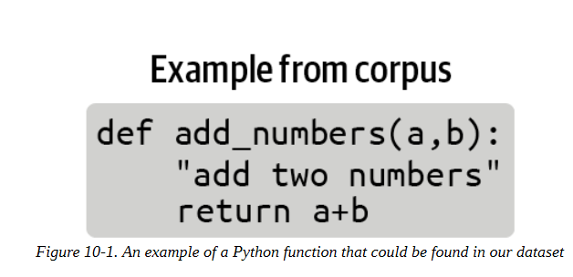

#### 因果语言模型

文本数据的一个自然任务是向模型提供一个代码样本的开头，并要求它产生可能的完成度。这是一个自我监督的训练目标，我们可以使用没有注释的数据集。这应该有印象：这就是我们在第五章中遇到的因果语言建模的任务。一个直接相关的下游任务是代码自动完成，所以我们一定会把这个模型列入候选名单。像GPT系列模型这样的纯解码器架构通常最适合这项任务，如图10-2所示。


#### 屏蔽式语言建模

一个相关但稍有不同的任务是向模型提供一个有噪声的代码样本，例如用一个随机的或被掩盖的词取代一个代码指令，并要求它重建原来的干净样本，如图10-3所示。这也是一个自我监督的训练目标，通常被称为屏蔽语言建模或去噪目标。要想出一个与去噪直接相关的下游任务是比较困难的，但是去噪通常是一个很好的预训练任务，可以为以后的下游任务学习一般表征。我们在前几章中使用的许多模型（如BERT和XLM-RoBERTa）都是以这种方式预训练的。因此，在一个大的语料库上训练一个遮蔽的语言模型，可以与在一个下游任务上对模型进行微调相结合，而这个下游任务的标注例子数量有限。


#### 顺序到顺序的训练

另一个任务是使用像正则表达式这样的启发式方法，将注释或文档串与代码分开，并建立一个大规模的（代码，注释）对的数据集，可以作为注释数据集使用。然后，训练任务是一个有监督的训练目标，其中一个类别（代码或注释）被用作模型的输入，另一个类别（注释或代码）被用作标签。这是一个带有（输入，标签）对的监督学习的案例，如图10-4所强调的。有了一个大的、干净的、多样化的数据集，以及一个有足够能力的模型，我们可以尝试训练一个模型，学习在代码中转录评论，或者反过来。与这个有监督的训练任务直接相关的下游任务是根据代码生成文档或根据文档生成代码，这取决于我们如何设置我们的输入/输出。在这种设置下，一个序列被翻译成另一个序列，这就是T5、BART和PEGASUS等编码器-解码器架构的魅力所在。

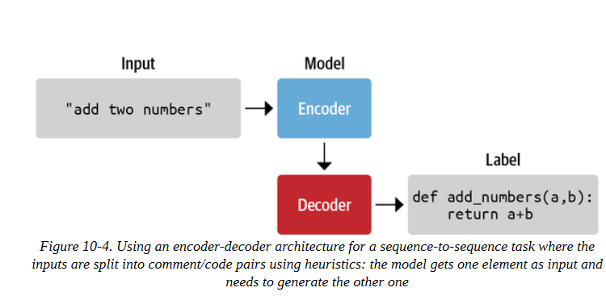

由于我们想建立一个代码自动完成模型，我们将选择第一个目标并选择一个GPT架构来完成任务。因此，让我们初始化一个新的GPT-2模型吧!

#### 初始化模型

这是本书中第一次我们不使用from_pretrained()方法来加载模型，而是初始化新模型。然而，我们将加载gpt2-xl的配置，因此我们使用相同的超参数，只为新的标记器调整词汇量大小。然后我们通过from_config()方法用这个配置初始化一个新的模型：

```
rom transformers import AutoConfig, AutoModelForCausalLM, AutoTokenizer 
tokenizer = AutoTokenizer.from_pretrained(model_ckpt) 
config = AutoConfig.from_pretrained("gpt2-xl", vocab_size=len(tokenizer))
model = AutoModelForCausalLM.from_config(config)

```

让我们看看这个模型到底有多大：

```
print(f'GPT-2 (xl) size: {model_size(model)/1000**2:.1f}M parameters')
GPT-2 (xl) size: 1529.6M parameters

```

这是一个1.5B的参数模型! 这是一个很大的容量，但我们也有一个大的数据集。一般来说，只要数据集合理地大，大型语言模型的训练就更有效率。让我们把新初始化的模型保存在models/文件夹中，并把它推送到Hub上：

```
model.save_pretrained("models/" + model_ckpt, push_to_hub=True, organization=org)

```

鉴于检查点的大小（大于5GB），将模型推送到Hub可能需要几分钟。由于这个模型相当大，我们还将创建一个较小的版本，在扩大规模之前，我们可以训练以确保一切正常。我们将以标准的GPT-2尺寸为基础：

```
tokenizer = AutoTokenizer.from_pretrained(model_ckpt) 
config_small = AutoConfig.from_pretrained("gpt2", vocab_size=len(tokenizer)) 
model_small = AutoModelForCausalLM.from_config(config_small) 
print(f'GPT-2 size: {model_size(model_small)/1000**2:.1f}M parameters')

GPT-2 size: 111.0M parameters

```

让我们也把它保存到中心，以便于分享和重复使用：

```
model_small.save_pretrained("models/" + model_ckpt + "-small", push_to_hub=True, organization=org)

```

现在我们有了两个可以训练的模型，我们需要确保在训练期间可以有效地给它们提供输入数据。

#### 实现Dataloader

为了能够以最大的效率进行训练，我们将希望为我们的模型提供填充其上下文的序列。例如，如果我们的模型的上下文长度是1,024个标记，我们总是希望在训练中提供1,024个标记的序列。但是我们的一些代码实例可能比1,024个标记短或长。为了给我们的模型提供完整的sequence_length序列，我们应该放弃最后一个不完整的序列，或者将其填充。然而，这将使我们的训练效率略微降低，并迫使我们注意填充和掩盖填充的标记标签。我们在计算方面比在数据方面更受限制，所以我们将采取简单有效的方法。我们可以使用一个小技巧来确保我们不会丢失太多的尾部片段：我们可以对几个例子进行标记，然后将它们连接起来，用特殊的序列结束标记分开，得到一个很长的序列。最后，我们将这个序列分割成同样大小的小块，如图10-5所示。采用这种方法，我们最多只损失了最后一小部分的数据。

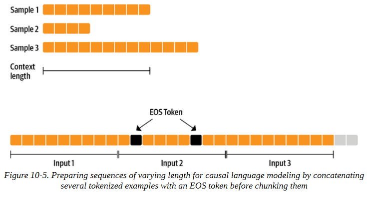

例如，我们可以通过将输入字符串的字符长度定义为，确保我们的标记化实例中有大约一百个完整的序列：

```
input_characters = number_of_sequences * sequence_length * characters_per_token

```

这里：

- input_characters是输入到我们标记器的字符串中的字符数。

- number_of_sequences是我们希望从我们的标记器中得到的（截断的）序列的数量，（例如，100）。
- sequence_length是由标记化器返回的每个序列的标记数，（例如，1,024）。
- characters_per_token是我们首先需要估计的每个输出标记的平均字符数。

如果我们输入一个带有input_characters字符的字符串，我们将因此得到平均数_of_sequences的输出序列，我们可以很容易地计算出丢掉最后一个序列会损失多少输入数据。如果number_of_sequences=100，这意味着我们大约堆叠了100个序列，最多失去最后一个元素，这可能太短或太长。这相当于最多失去我们数据集的1%。同时，这种方法确保我们不会因为切断大多数文件的结尾而引入偏见。

让我们首先估计一下我们的数据集中每个符号的平均字符长度：

```
examples, total_characters, total_tokens = 500, 0, 0 
dataset = load_dataset('transformersbook/codeparrot-train', split='train', streaming=True) 
for _, example in tqdm(zip(range(examples), iter(dataset)), total=examples): 
	total_characters += len(example['content']) 
	total_tokens += len(tokenizer(example['content']).tokens())
characters_per_token = total_characters / total_tokens print(characters_per_token) 3.6233025034779565

```

有了这些，我们就拥有了创建我们自己的IterableDataset（这是PyTorch提供的一个辅助类）所需的一切，以便为模型准备恒定长度的输入。我们只需要继承IterableDataset，并设置__iter__()函数，用我们刚才的逻辑产生下一个元素：

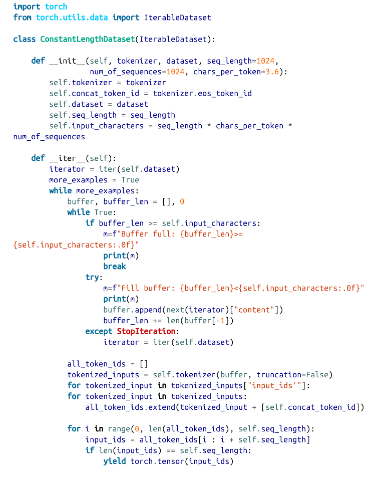

__iter__()函数建立了一个字符串的缓冲区，直到它包含足够的字符。缓冲区中的所有元素被标记化，并与EOS标记相连接，然后all_token_ids中的长序列被分块为seq_length大小的片断。通常情况下，我们需要注意掩码来堆叠不同长度的填充序列，并确保在训练期间忽略填充。我们通过只提供相同（最大）长度的序列来解决这个问题，所以我们在这里不需要掩码，只返回input_ids。让我们测试一下我们的可迭代数据集：

```
shuffled_dataset = dataset.shuffle(buffer_size=100)
constant_length_dataset = ConstantLengthDataset(tokenizer, shuffled_dataset, num_of_sequences=10) 
dataset_iterator = iter(constant_length_dataset) 
lengths = [len(b) for _, b in zip(range(5), dataset_iterator)]
print(f"Lengths of the sequences: {lengths}") 
Fill buffer: 0<36864 
Fill buffer: 3311<36864 
Fill buffer: 9590<36864 
Fill buffer: 22177<36864
Fill buffer: 25530<36864
Fill buffer: 31098<36864 
Fill buffer: 32232<36864 
Fill buffer: 33867<36864 
Buffer full: 41172>=36864 Lengths of the sequences: [1024, 1024, 1024, 1024, 1024]

```

很好，这和预期的一样，我们为模型得到了恒定长度的输入。现在，我们有了一个可靠的模型数据源，是时候建立实际的训练循环了。

**小技巧**

注意，在创建ConstantLengthDataset之前，我们洗了原始数据集。因为这是一个可迭代的数据集，我们不能一开始就乱序整个数据集。相反，我们设置了一个大小为buffer_size的缓冲区，在我们从数据集中获取元素之前，对这个缓冲区中的元素进行乱序。

### 定义训练循环

我们现在有了所有的元素来编写我们的训练循环。训练我们自己的语言模型的一个明显限制是我们将使用的GPU的内存限制。即使在现代图形卡上，你也无法在合理的时间内训练一个GPT-2规模的模型。在本教程中，我们将实现数据并行化，这将有助于我们利用几个GPU进行训练。

幸运的是，我们可以使用加速器来使我们的代码具有可扩展性。加速器库的设计是为了使分布式训练--改变训练的底层硬件--变得简单。我们也可以使用训练器进行分布式训练，但加速器让我们完全控制训练循环，这也是我们在这里想要探讨的。

Hugging Face 加速器提供了一个简单的API，使训练脚本以混合精度和任何类型的分布式设置（单GPU、多GPU和TPU）运行。然后，相同的代码可以在你的本地机器上无缝运行，用于调试目的，或者在你的强大的训练集群上进行最终的训练运行。你只需要对你的本地PyTorch训练循环做少量的修改。

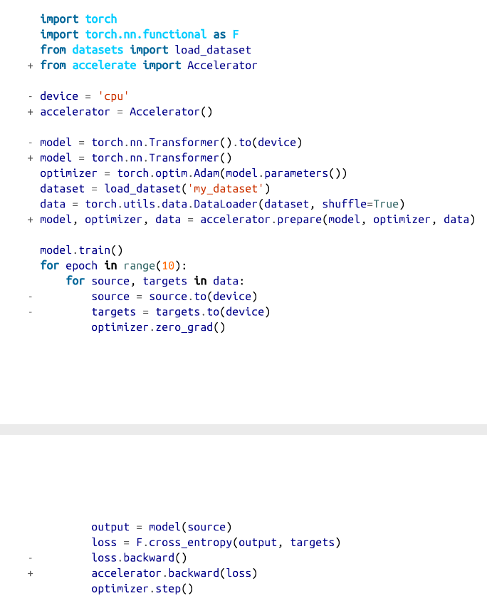

这些变化的核心部分是对prepare()的调用，它可以确保模型、优化器和数据加载器都已准备好并分布在基础设施上。对PyTorch训练循环的这些细微变化使你能够轻松地在不同的基础设施上扩展训练。考虑到这一点，让我们开始建立我们的训练脚本并定义一些辅助函数。首先，我们设置训练用的超参数，并将它们封装在一个命名空间中，以便于访问:

```
from argparse import Namespace 
# Commented parameters correspond to the small model 
config = {"train_batch_size": 2, # 12 
        "valid_batch_size": 2, # 12 
        "weight_decay": 0.1, "shuffle_buffer": 1000, "learning_rate": 2e-4, # 5e-4
        "lr_scheduler_type": "cosine", "num_warmup_steps": 750, # 2000 
        "gradient_accumulation_steps": 16, # 1 "max_train_steps": 50000, # 150000 
        "max_eval_steps": -1, "seq_length": 1024, "seed": 1, "save_checkpoint_steps": 50000} # 15000 
args = Namespace(**config)

```

接下来，我们设置了训练的日志。由于我们要从头开始训练一个模型，训练运行将需要一段时间，并需要昂贵的基础设施。因此，我们要确保所有的相关信息都被储存起来，并且容易访问。setup_logging()方法设置了三个级别的日志：使用标准的Python Logger，TensorBoard，以及Weights & Biases。根据你的喜好和使用情况，你可以在这里添加或删除日志框架:

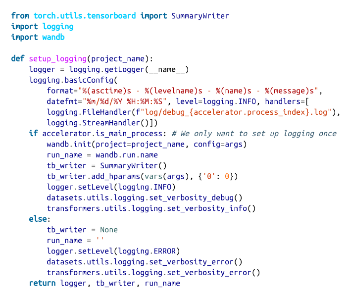

每个 Worker 都有一个唯一的 accelerator.process_index，我们将其与 FileHandler 一起使用，将每个 Worker 的日志写入一个单独的文件中。我们还使用了 accelerator.is_main_process 属性，该属性仅对主工作器为真。我们确保不多次初始化TensorBoard和Weights & Biases日志，并降低其他工作器的日志级别。我们返回自动生成的、唯一的wandb.run.name，以后我们用它来命名我们在Hub上的实验分支。

我们还将定义一个函数，用TensorBoard和Weights & Biases记录指标。我们在这里再次使用加速器.is_main_process，以确保我们只记录一次指标，而不是为每个工作者记录:

```
def log_metrics(step, metrics): 
	logger.info(f"Step {step}: {metrics}"
	if accelerator.is_main_process: 
		wandb.log(metrics) [tb_writer.add_scalar(k, v, step) for k, v in metrics.items()]

```

接下来，让我们写一个函数，用我们全新的ConstantLengthDataset类为训练集和验证集创建数据转换器:

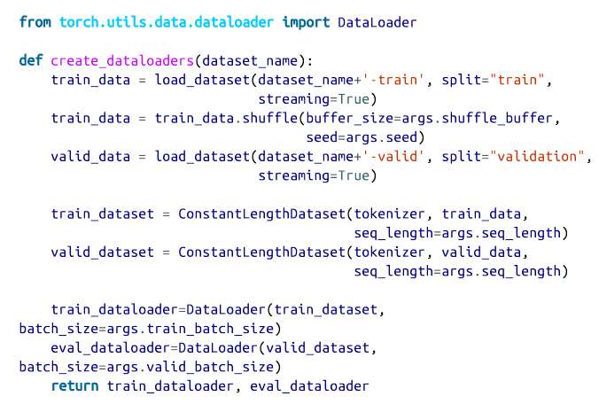

在最后，我们将数据集包裹在一个DataLoader中，它也处理批处理。加速器将负责将批处理分配给每个工作者。

我们需要实现的另一个方面是优化。我们将在主循环中设置优化器和学习率计划，但是我们在这里定义了一个辅助函数来区分应该接受权重衰减的参数。一般来说，偏差和LayerNorm权重不受权重衰减的影响:

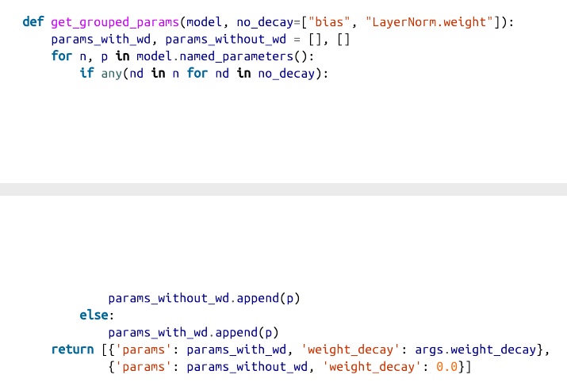

最后，我们希望不时地在验证集上评估模型，所以让我们添加一个我们可以调用的评估函数，计算评估集上的损失和困惑度:

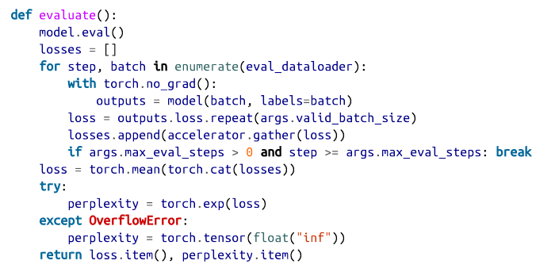

困惑度衡量模型的输出概率分布对目标标记的预测程度。因此，较低的plexity对应于较好的性能。请注意，我们可以通过对模型输出的交叉熵损失进行指数化来计算迷惑度。特别是在训练开始的时候，当损失还很高的时候，在计算perplexity的时候有可能会出现数字溢出。我们抓住这个错误，在这些情况下将困惑度设置为无穷大。在我们把这一切放在训练脚本中之前，还有一个额外的函数我们要使用。正如你现在所知道的，Hugging Face Hub在引擎盖下使用Git来存储和版本模型和数据集。通过huggingface_hub库中的存储库类，你可以以编程方式访问存储库并拉取、分支、提交或推送。

我们将在我们的脚本中使用这一点，在训练过程中不断推送模型检查点到Hub。

现在我们已经有了所有这些辅助函数，我们已经准备好编写训练脚本的核心：

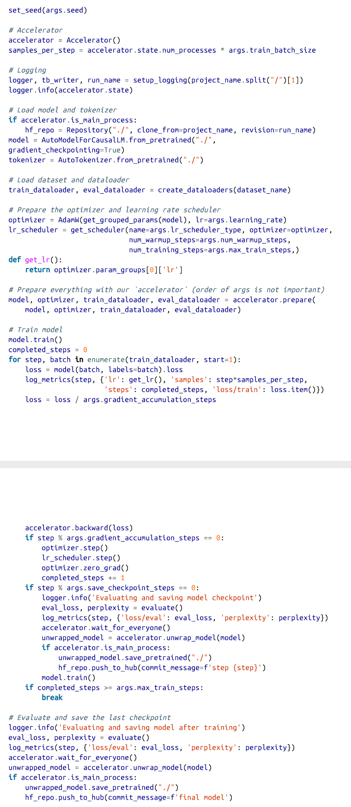

这是一个相当大的代码块，但请记住，这是你在分布式基础设施上训练一个花哨的大型语言模型所需要的所有代码。让我们稍微解构一下这个脚本，突出最重要的部分：

**保存模型** 

我们在模型库中运行该脚本，在开始时，我们检查出一个新的分支，以我们从Weights & Biases得到的run_name命名。之后，我们在每个检查点提交模型，并将其推送到Hub上。通过这种设置，每个实验都在一个新的分支上，每次提交都代表一个模型检查点。注意，我们需要调用wait_for_everyone()和unwrap_model()，以确保模型在我们存储时被正确地同步了。

**优化** 

对于模型的优化，我们使用AdamW，在一个线性预热期后，使用余弦学习率计划。对于超参数，我们严格遵循GPT-3论文中描述的类似尺寸模型的参数。

 **评价** 

我们在每次保存时--即每次保存_检查点_步骤和训练后--在评估集上评估该模型。与验证损失一起，我们还记录了验证的困惑。

 **梯度积累和检查点** 
即使我们在最新的GPU上运行，所需的批次大小也不适合GPU的内存。因此，我们实现了梯度积累，在几个后向通道上收集梯度，一旦积累了足够的梯度就进行优化。在第6章中，我们看到了我们如何用训练器来做这件事。对于大型模型来说，即使是单批也不太适合在单个GPU上使用。使用一种叫做梯度检查点的方法，我们可以用一些内存占用换取大约20%的训练速度。这使得我们甚至可以在单个GPU上适应大型模型。

有一个方面可能仍然有点晦涩难懂，那就是在多个GPU上训练一个模型意味着什么。有几种方法可以以分布式的方式训练模型，这取决于你的模型的大小和数据量。加速器使用的方法被称为数据分布式并行（DDP）。这种方法的主要优点是，它允许你以更大的批处理规模更快地训练模型，而这些批处理规模不适合任何单一的GPU。该过程如图10-6所示。

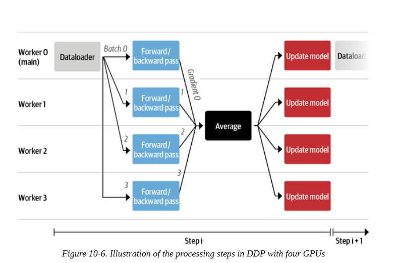

让我们一步一步描述这个流水线。
1. 每个工作者由一个GPU组成。在加速器中，有一个运行在主进程上的数据加载器，它准备好数据的批次，并将其发送给所有的工作者。

 2. 每个GPU接收一批数据，并通过模型的本地副本计算前向和后向的损失和各自的累积梯度。

3. 每个节点的梯度用还原模式进行平均，平均后的梯度被送回给每个工作者。

4. 在每个节点上使用优化器单独应用梯度。虽然这可能看起来是多余的工作，但它避免了在节点之间传输大型模型的副本。我们至少需要更新一次模型，如果没有这种方法，其他节点将需要等待，直到他们收到更新的版本。

5. 一旦所有的模型都更新了，我们就重新开始，由主要的工作者准备新的批次。

   


这种简单的模式使我们能够通过扩展到可用的GPU数量来极快地训练大型模型，而无需太多的额外逻辑。然而，有时候，这还不够。例如，如果模型不适合在单个GPU上使用，你可能需要更复杂的并行化策略。现在我们已经有了训练所需的所有部件，是时候启动一个作业了！你将在接下来的章节中看到。正如你在下一节所看到的，这是很简单的事情。

### 训练

我们将训练脚本保存在一个名为 codeparrot_training.py 的文件中，这样我们就可以在训练服务器上执行它。为了让生活更加简单，我们将它和一个包含所有必要的 Python 依赖关系的 requirements.txt 文件一起添加到 Hub 上的模型仓库。记住，Hub上的模型本质上是Git仓库，所以我们可以直接克隆仓库，添加我们想要的任何文件，然后将它们推送回Hub。在训练服务器上，我们可以通过以下几个命令来启动训练：

```
$ git clone https://huggingface.co/transformersbook/codeparrot 
$ cd codeparrot 
$ pip install -r requirements.txt 
$ wandb login
$ accelerate config
$ accelerate launch codeparrot_training.py

```

就这样--我们的模型现在开始训练了! 请注意，wandb登录后会提示你用Weights & Biases进行认证，以便记录。加速配置命令将指导你完成基础设施的设置；你可以在表102中看到这个实验中使用的设置。我们使用一个a2-megagpu-16g实例来进行所有的实验，这是一个有16个A100 GPU的工作站，每个有40GB的内存。

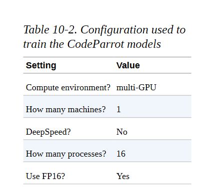

在该基础设施上用这些设置运行训练脚本，小型和大型模型分别需要24小时和7天左右。如果你训练自己的自定义模型，确保你的代码在较小的基础设施上顺利运行，以确保昂贵的长期运行也能顺利进行。在完整的训练运行成功完成后，你可以用以下命令将Hub上的实验分支合并回主分支：

```
$ git checkout main 
$ git merge <RUN_NAME> 
$ git push

```

当然，RUN_NAME应该是你想合并的Hub上的实验分支的名字。现在我们有了一个训练有素的模型，让我们来看看如何调查它的性能。

## 结果和分析

在焦急地监控了一周的日志之后，你可能会看到损失和困惑曲线看起来像图10-7所示的那样。训练损失和验证困惑持续下降，而损失曲线在对数尺度上看起来几乎是线性的。我们还看到，大模型在处理标记方面收敛得更快，尽管整个训练需要更长时间。

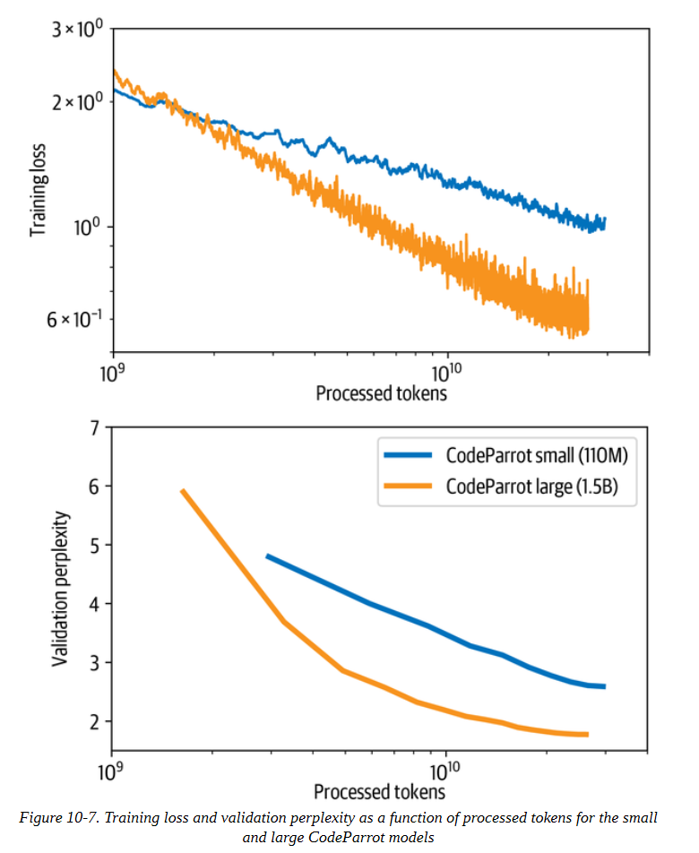

那么，我们可以用我们刚出炉的语言模型做什么呢，直接从GPU烤箱里出来？嗯，我们可以用它来为我们写一些代码。我们可以进行两种类型的分析：定性和定量的分析。在前一种情况下，我们看具体的例子，并试图更好地了解模型在哪些情况下是成功的，在哪些情况下是失败的。在后一种情况下，我们在一大批测试案例上统计评估模型的性能。在本节中，我们将探讨如何使用我们的模型。首先我们看一下几个例子，然后我们简单讨论一下我们如何能够系统地、更稳健地评估这个模型。首先，让我们把小模型包在一个流水线里，用它来继续一些代码输入：

```
rom transformers import pipeline, set_seed 
model_ckpt = 'transformersbook/codeparrot-small' 
generation = pipeline('text-generation', model=model_ckpt, device=0)

```

现在我们可以使用生成流水线从一个给定的提示中生成候选的完成度。默认情况下，该流水线将生成代码，直到预定义的最大长度，而且输出可能包含多个函数或类。因此，为了保持输出的简洁，我们将实现一个first_block()函数，使用正则表达式来提取一个函数或类的第一次出现。下面的complete_code()函数应用这个逻辑来打印出由CodeParrot生成的补全内容：

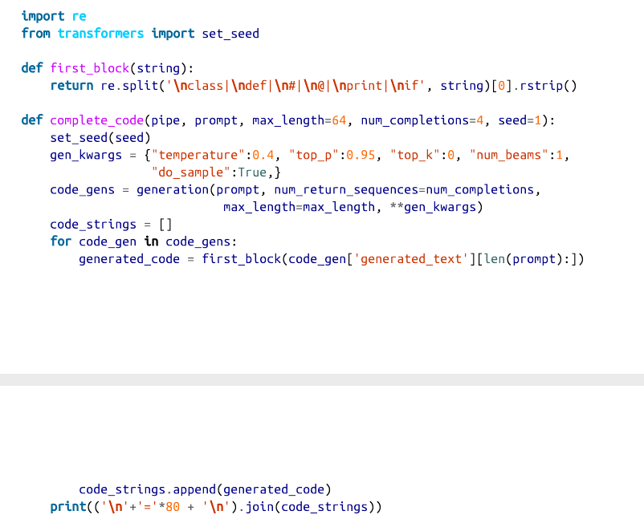

让我们从一个简单的例子开始，让模型为我们写一个计算矩形面积的函数：

```
prompt = '''def area_of_rectangle(a: float, b: float): """Return the area of the rectangle."""''' 
complete_code(generation, prompt) 
return math.sqrt(a * b) ============================================================================== 
== return a * b / 2.0 ============================================================================== 
== return a * b ============================================================================== 
== return a * b / a

```

这看起来很不错! 虽然不是所有的代数都是正确的，但正确的解决方案就在其中。现在，这个模型还能解决从HTML字符串中提取URL这一更复杂的任务吗？让我们来看看：

```
prompt = '''def get_urls_from_html(html): """Get all embedded URLs in a HTML string."""''' 
complete_code(generation, prompt) 
if not html: 
	return [] 
return [url for url in re.findall(r'<a href="(/[^/]+/[^"]+?)">', html)] ============================================================================== 
== return [url for url in re.findall(r'<a href="(.*?)"', html) if url] ============================================================================== 
=
return [url for url in re.findall(r'<a href="(/.*)",', html)] ============================================================================== 
== return re.findall(r'<a href="(.*?)" class="url"[^>]*>', html)

```

虽然它在第二次尝试中没有完全正确，但其他三代都是正确的。我们可以在 "拥抱的脸 "主页上测试这个功能：

```
import requests 
def get_urls_from_html(html): 
	return [url for url in re.findall(r'<a href="(.*?)"', html) if url] 
print(" | ".join(get_urls_from_html(requests.get('https://hf.co/').text))) 

https://github.com/huggingface/transformers | /allenai | /facebook | /asteroid-team | /google | /amazon | /speechbrain | /microsoft | /grammarly | /models | /inference-api | /distilbert-base-uncased | /dbmdz/bert-large-cased-finetuned-conll03-english | https://huggingface.co/transformers | https://arxiv.org/abs/1811.06031 | https://arxiv.org/abs/1803.10631 | https://transformer.huggingface.co/ | /coref | https://medium.com/huggingface/distilbert-8cf3380435b5

```

我们可以看到，所有以https开头的URL都是外部网页，而其他的是主网站的子页面。这正是我们想要的。最后，让我们加载这个大模型，看看我们是否可以用它来把一个函数从纯Python翻译成NumPy：

```
model_ckpt = 'transformersbook/codeparrot' 
generation = pipeline('text-generation', model=model_ckpt, device=0)
prompt = '''
# a function in native python: 
def mean(a): 
	return sum(a)/len(a) 
# the same function using numpy: import numpy as np def mean(a):''' 

complete_code(generation, prompt, max_length=64)

```

```
Setting `pad_token_id` to `eos_token_id`:0 for open-end generation.
return np.mean(a) ============================================================================== == 
return np.mean(a) ============================================================================== ==
return np.mean(a) ============================================================================== == 
return np.mean(a)

```

这就成功了! 让我们看看我们是否也能使用CodeParrot模型来帮助我们建立一个Scikit-learn模型：

```
prompt = '''X = np.random.randn(100, 100) 
y = np.random.randint(0, 1, 100) 
# fit random forest classifier with 20 estimators''' 
complete_code(generation, prompt, max_length=96) 

Setting `pad_token_id` to `eos_token_id`:0 for open-end generation. reg = DummyRegressor() forest = RandomForestClassifier(n_estimators=20) 
forest.fit(X, y) ============================================================================== == 
clf = ExtraTreesClassifier(n_estimators=100, max_features='sqrt')
clf.fit(X, y) ============================================================================== == 
clf = RandomForestClassifier(n_estimators=20, n_jobs=n_jobs, random_state=1) 
clf.fit(X, y) ============================================================================== =
clf = RandomForestClassifier(n_estimators=20) 
clf.fit(X, y)

```

尽管在第二次尝试中，它试图训练一个extra-trees 分类器，但它产生了我们在其他情况下要求的东西。

在第5章中，我们探讨了一些衡量生成文本质量的指标。其中，BLEU分数是经常被用于该目的的。虽然这个指标在总体上有局限性，但它特别不适合我们的用例。BLEU分数衡量参考文本和生成文本之间n-grams的重叠程度。在编写代码时，我们在变量和类方面有很大的自由度，只要命名方案是一致的，程序的成功就不取决于它。然而，BLEU分数会惩罚偏离参考命名的生成，事实上，这可能几乎是不可能预测的（即使对人类编码员来说）。


在软件开发中，有更好、更可靠的方法来衡量代码的质量，例如单元测试。这就是所有OpenAI Codex模型的评估方式：通过一组单元测试来运行几代编码任务的代码，并计算出通过测试的几率。对于一个适当的性能测量，我们应该对我们的模型应用同样的评估方案，但这超出了本章的范围。你可以在该模型的配套博文中找到关于CodeParrot在HumanEval基准上的表现的细节。


## 小结

让我们回过头来思考一下我们在本章中取得的成果。我们开始为Python创建一个代码自动完成功能。首先，我们建立了一个适合预训练大型语言模型的定制的大规模数据集。然后我们创建了一个定制的标记器，能够用该数据集对Python代码进行有效编码。最后，在Accelerate的帮助下，我们把所有东西放在一起，写了一个训练脚本，在多GPU基础设施上从头开始训练小型和大型版本的GPT-2模型，代码不到两百行。调查模型的输出，我们看到它可以产生合理的代码连续性，我们讨论了如何系统地评估该模型。

你现在不仅知道如何微调Hub上的许多预训练模型，而且还知道当你有足够的数据和计算资源可用时，如何从头开始预训练一个自定义模型。你现在已经准备好用转化器处理几乎所有的NLP用例。那么问题来了：下一步该怎么做？在下一章，也是最后一章，我们将看看这个领域目前的发展情况，以及在NLP转化器模型之外还有哪些新的令人兴奋的应用和领域可以解决。
